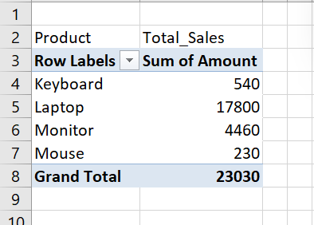
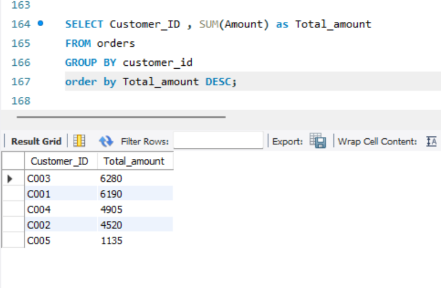
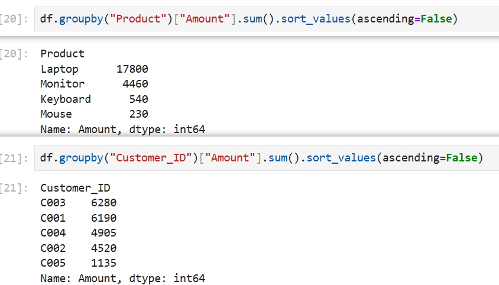

# 📈 Sales Data Analysis (Excel + SQL + Python)

## 🎯 Objective  
To analyze sales data and identify total revenue, top-performing products, and high-value customers using Excel, SQL, and Python.

---

## 🛠️ Tools Used  
- Excel (Data Cleaning, Pivot Tables)  
- SQL (Aggregations, GROUP BY)  
- Python (Pandas)  

---

## 📂 Dataset  
- Sample sales dataset (Excel file)

---

## 🔍 Analysis Performed  
- Cleaned and structured raw data in Excel  
- Calculated total sales using Excel, SQL, and Python  
- Identified top-selling product  
- Determined highest spending customer  
- Cross-verified results across all tools  

---

## 📈 Key Insights  

- Total sales value: **23030**  
- Top-selling product: **Laptop**  
- Highest spending customer: **C003**  

---

## 💡 Business Impact  

- Helps businesses identify best-selling products  
- Supports targeting high-value customers  
- Enables better sales strategy planning  

---

## 📌 Skills Demonstrated  
- Data Cleaning  
- Data Analysis  
- SQL Aggregation  
- Python Pandas  
- Business Insight Generation

---

## 📊 Output Preview

